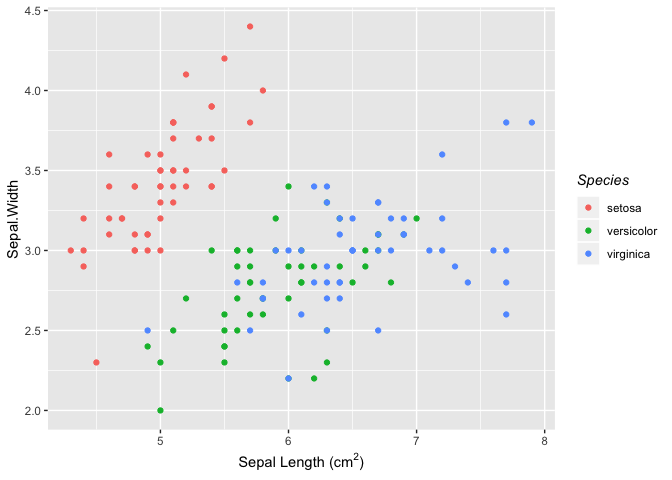
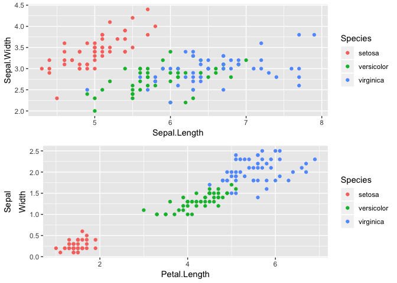
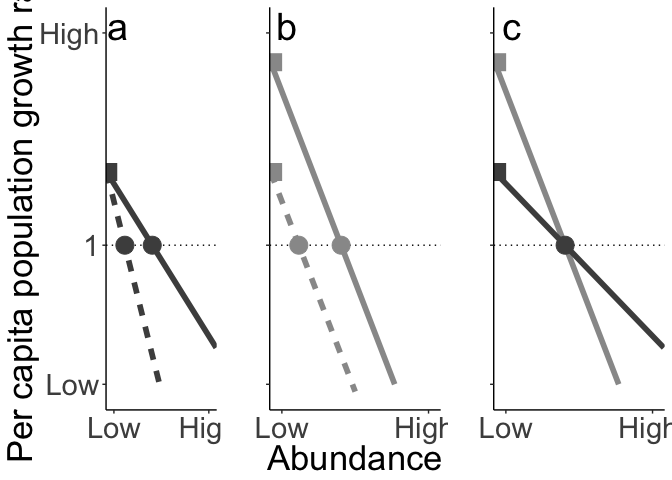

## ggplot2 prettying (italics, etc)


```r
library(tidyverse)
data(iris)

ggplot(iris, aes(x = Sepal.Length, y = Sepal.Width, color = Species)) + geom_point() + 
  # make the species label italics
  labs(color = expression(italic("Species"))) +
  # include superscripts 
  # these data are not squared! just showing you for the pedagogy
  labs(x = expression(paste("Sepal Length (cm"^2,")"))) 
```

<!-- -->

## ggplot2 & data export 
One topic we haven't learned yet is how to export individual graphs:  
- the function `ggsave()` allows you to export a graph  
- `ggsave()` will guess the type of plot based on the extension you specify  
- You can also set the size and resolution  
- the function `write_csv()` in the `tidyverse` will allow you to export your dataset  


## ggplot2 - Multiple panels

### `gridExtra`
The package `gridExtra` helps to arrange multiple panels. It can be a little clunky to do more fancy things (share a legend, align plots, etc) but there are quite a few online examples.

#### Iris example  
Here's an example with the iris dataset

```r
library(gridExtra)
a <- ggplot(iris, aes(x = Sepal.Length, y = Sepal.Width, color = Species)) + geom_point() 
b <- ggplot(iris, aes(x = Petal.Length, y = Petal.Width, color = Species)) + geom_point() +
  labs(y = expression(atop(paste("Sepal"), paste("Width"))))

grid.arrange(a,b)
```

<!-- -->

Now make the axes line up! 

```r
##make the axes line up
plots <- list(a,b)
grobs <- list()
widths <- list()

# pull out the widths and lengths of each plot
for (i in 1:length(plots)){
  grobs[[i]] <- ggplotGrob(plots[[i]])
  widths[[i]] <- grobs[[i]]$widths[2:5]
}

# set the max width
maxwidth <- do.call(grid::unit.pmax, widths)

for (i in 1:length(grobs)){
  grobs[[i]]$widths[2:5] <- as.list(maxwidth)
}

do.call("grid.arrange", c(grobs, ncol = 1))
```

<!-- -->

#### Lauren's paper example  
Here's an example from my latest paper.
We aren't going to walk through it in class, but sometimes it is nice to have a more detailed graph code to play with
(e.g., on your own time, could you figure out what each section was doing?)

```r
####Figure 1 conceptual#####

## Set the dummy data

# values of the equilibrium abundance
meanequil <- seq(0, 30)
spp <- c("a", "b")

# set expand all possible values
meanequildummy <- expand.grid(spp, meanequil) %>%
  mutate(spp=as.character(Var1), abund=Var2) %>%
  dplyr::select(spp, abund)

# set different slopes and lambdas
slope3 <- c(.2, .08)
lambda3 <- c(3.5, 2)

slope1 <- c(.2, .2)
lambda1 <- c(3.5, 2)

lambda2 <- c(2, 2)
slope2 <- c(.08, .2)

# put it all together
slopes <- as.data.frame(cbind(spp, lambda3, slope3, slope1, lambda1, slope2, lambda2)) %>%
  mutate(spp=as.character(spp), 
         lambda3=as.numeric(as.character(lambda3)), slope3=as.numeric(as.character(slope3)),
         lambda1=as.numeric(as.character(lambda1)), slope1=as.numeric(as.character(slope1)),
         lambda2=as.numeric(as.character(lambda2)), slope2=as.numeric(as.character(slope2))) 

dummy2 <- merge(meanequildummy, slopes) %>%
  mutate(growth3=lambda3-slope3*abund) %>%
  mutate(growth1=lambda1-slope1*abund) %>%
  mutate(growth2=lambda2-slope2*abund) %>%
  dplyr::select(spp, abund, growth1, growth2, growth3) %>%
  gather(panel, growth, growth1:growth3) %>%
  mutate(panel=as.character(panel)) %>%
  mutate(lab="a)", lab=ifelse(panel=="growth2", "b)", lab), lab=ifelse(panel=="growth3", "c)", lab))


# graph it!
fig1a <- ggplot(subset(dummy2, panel=="growth2"), aes(x=abund, y=growth, color=spp, linetype=spp)) + geom_line(size=2) + 
  theme_classic() + theme(strip.background = element_blank(),
                          strip.text.x = element_blank(),   text = element_text(size=20)) +
  guides(colour=FALSE, linetype=FALSE) + geom_hline(aes(yintercept=1), linetype="dotted") +  labs(x="", y="Per capita population growth rate") + 
  scale_color_manual(values=c("grey30", "grey30")) + 
  scale_x_continuous(limits=c(0, 30),  expand = c(.005, .005), breaks = c(2,28), labels=c("Low", "High"))  + 
  scale_y_continuous(breaks = c( -.9, 1, 3.9), labels=c("Low", "1", "High"), limits=c(-1, 4)) +
  # annotate("point", x=0.3, y=2, pch=15, size=6, color="grey60") + 
     annotate("point", x=0.45, y=2, pch=15, size=6, color="grey30") + 
  annotate("point", y=1, x=12.5, size=6, color="grey30") +
  annotate("point", y=1, x=5, size=6, color="grey30") 

fig1b <- ggplot(subset(dummy2, panel=="growth1"), aes(x=abund, y=growth, linetype=spp, color=spp)) + geom_line(size=2) + 
  theme_classic() + theme(strip.background = element_blank(),
                          strip.text.x = element_blank(),   text = element_text(size=20)) +
  guides(colour=FALSE, linetype=FALSE) + geom_hline(aes(yintercept=1), linetype="dotted") +  
  labs(x="Abundance", y="") + scale_color_manual(values=c("grey60", "grey60")) +
  scale_x_continuous(limits=c(0, 30),  expand = c(.005, .005), breaks = c(2,28), labels=c("Low", "High "))  + 
  scale_y_continuous(breaks = c(-.9,1, 3.9), labels=c( "","",""), limits=c(-1, 4)) +
    annotate("point", x=0.45, y=3.5, pch=15, size=6, color="grey60") +
   annotate("point", x=0.45, y=2, pch=15, size=6, color="grey60") + 
  annotate("point", y=1, x=5, size=6, color="grey60") +
  annotate("point", y=1, x=12.5, size=6, color="grey60")


fig1c <- ggplot(subset(dummy2, panel=="growth3"), aes(x=abund, y=growth, color=spp)) + geom_line(size=2) + 
  theme_classic() + theme(strip.background = element_blank(),
                          strip.text.x = element_blank(),   text = element_text(size=20)) +
  guides(colour=FALSE) + geom_hline(aes(yintercept=1), linetype="dotted") +  
  labs(x="", y="") + scale_color_manual(values=c("grey60", "grey30")) +
  scale_x_continuous(limits=c(0, 30),  expand = c(.005, .005), breaks = c(2,28), labels=c("Low", "High "))  + 
  scale_y_continuous(breaks = c(-.9,1,3.9), labels=c("","", ""), limits=c(-1, 4)) +
    annotate("point", x=0.45, y=2, pch=15, size=6, color="grey30") + 
   annotate("point", x=0.45, y=3.5, pch=15, size=6, color="grey60") + 
  # annotate("point", y=1, x=12.5, size=6, color="grey90")# +
  annotate("point", y=1, x=12.5, size=6, color="grey30") 


# Put the figures!
grid.arrange(fig1a + annotate("text", x=3, y=4, label="a", size=10) + theme(text = element_text(size = 26),
                                                                            axis.text = element_text(size = 22)), 
             fig1b + annotate("text", x=3, y=4, label="b", size=10) + theme(text = element_text(size = 26),
                                                                            axis.text = element_text(size = 22)), 
             fig1c + annotate("text", x=3, y=4, label="c", size=10)+ theme(text = element_text(size = 26),
                                                                           axis.text = element_text(size = 22)), ncol=3)
```

<!-- -->

A note on exporting with gridExtra

```r
## NOTE: ggsave() doesn't work with gridExtra - export this way
# pdf("Nature_fig1v4.pdf", width = 16, height = 6)
# grid.arrange(fig1a + annotate("text", x=3, y=4, label="a", size=10) + theme(text = element_text(size = 26),
#                                                                             axis.text = element_text(size = 22)), 
#              fig1b + annotate("text", x=3, y=4, label="b", size=10) + theme(text = element_text(size = 26),
#                                                                             axis.text = element_text(size = 22)), 
#              fig1c + annotate("text", x=3, y=4, label="c", size=10)+ theme(text = element_text(size = 26),
#                                                                            axis.text = element_text(size = 22)), ncol=3)
# dev.off()
```


### `cowplot`
`gridArrange` can be a little clunky. I've heard `cowplot` is better but haven't played with it much. Try it out!


## Equations
This series of exercises was developed by Jay Rotella in "Equation Examples in R Markdown"  

We can write fractions: $\frac{2}{3}$. We can also handle things like estimated population growth rate, e.g., $\hat{\lambda}=1.02$. And, $\sqrt{4}=2$.

$$\alpha, \beta,  \gamma, \Gamma$$

$$a \pm b$$
$$x \ge 15$$
$$a_i \ge 0~~~\forall i$$

### Matrix

$$A_{m,n} =
 \begin{pmatrix}
  a_{1,1} & a_{1,2} & \cdots & a_{1,n} \\
  a_{2,1} & a_{2,2} & \cdots & a_{2,n} \\
  \vdots  & \vdots  & \ddots & \vdots  \\
  a_{m,1} & a_{m,2} & \cdots & a_{m,n}
 \end{pmatrix}$$

### Statistics

The binomial probability: $$f(y|N,p) = \frac{N!}{y!(N-y)!}\cdot p^y \cdot (1-p)^{N-y} = {{N}\choose{y}} \cdot p^y \cdot (1-p)^{N-y}$$

To calculate the **mean** of \textit{n} observations of variable \textit{x}, you can use: $$\bar{x} = \frac{1}{n} \sum_{i=1}^{n}x_{i}$$ 

Note that this equation looks quite nice above where it's in display math mode. It is more compact but not quite as nice looking if we present it using inline mode, e.g., $\bar{x} = \frac{1}{n} \sum_{i=1}^{n}x_{i}$.

Let's do the same with the equation for **variance**. First the inline version, which is 
$\sigma^{2} = \frac{\sum\limits_{i=1}^{n} \left(x_{i} - \bar{x}\right)^{2}} {n-1}$. And then the display mode version: 
$$\sigma^{2} = \frac{\sum_{i=1}^{n} 
  \left(x_{i} - \bar{x}\right)^{2}}
  {n-1}$$
  
Next, it's good to look at the equation for **covariance** to see how it is just a generalization of variance to two variables. An inline version of the equation is $cov_{x,y} = \frac{\sum\limits_{i=1}^{n}{(x_i-\overline{x}) \cdot (y_i-\overline{y})} }{n-1}$. And, the display mode is: $$cov_{x,y} = \frac{\sum\limits_{i=1}^{n}{(x_i-\overline{x}) \cdot (y_i-\overline{y})} }{n-1}$$
  
And, finally, we'll end with the **standard deviation**. Here's the inline version, $\sigma = \sqrt{\frac{\sum\limits_{i=1}^{n} \left(x_{i} - \bar{x}\right)^{2}} {n-1}}$. And here's the display version.
$$\sigma = \sqrt{\frac{\sum\limits_{i=1}^{n} \left(x_{i} - \bar{x}\right)^{2}} {n-1}}$$

## R Graphics Gallery
There is a great resource called the R Graphics Gallery:
https://www.r-graph-gallery.com/portfolio/ggplot2-package/

Check out the graphics gallery, and in R chunks below replicate the code to make the following figures. Annotate any lines that are not yet annotated. Export at least one as a .pdf and another as a .jpg:

### 240 Custom ggplot2 background


### 233 Add text annotation


### 233 Add arrow


### 275 Add text label (any option)


### 289 Custom font of one word 


### 267 Reorder ggplot boxplot


##  Art!
Sometimes even when things go wrong there's a silver lining. Check out the accidental art created by errant R graphs:
http://accidental-art.tumblr.com/

### Exerise: Fine a favorite aRt, save the image and embed it below

## LaTeX
Installing LaTeX can be a bit involved. Apparently there is now an R package that streamlines installation! I've never used it, but you might want to check it out: https://cran.r-project.org/web/packages/tinytex/index.html

## Bibliography
You can make a responsive bibliography using BiblioTeX  
In the yaml header, include the following:  
bibliography: biblio.bib   

And you can set the style to match a given journal with this in the yaml header:  
csl: methods-in-ecology-and-evolution.csl   

The references will appear at the end of the document (this can be changed with templates).  

See the associated csl and biblio.bib file in the folder. Here's an intro from one of my papers to demonstrate:  

As long-term datasets increase in scope and length, new analytical tools are being developed to capture patterns of species interactions over time. This has the potential to deepen our understanding of ecological patterns and processes. For example, many traditional measurements of community structure, such as diversity indices and rank-abundance curves, represent 'snapshots in time' that poorly capture community dynamics. In contrast, the development of analogous temporal metrics, such as species turnover and rank shifts, has highlighted how much communities can vary over time [@collins2000; @Collins2008; @cleland2013]. Similarly, species dynamics can affect the stability of community properties. A growing number of synthesis studies have applied new metrics to long-term datasets to test what factors influence the stability of ecosystems [@houlahan2007; @Grman2010; @hector2010; @hallett2014]. As ecological records continue to grow and data storage and sharing barriers diminish, it is likely that these types of long-term studies will drive new advances in ecology.

However, there are several impediments to the broad adoption of temporal analyses by the ecological community. First, many metrics of community dynamics have not yet been published as functions in R. Although R is becoming the programming language of choice for most ecologists, the majority of ecologists rely on published instead of self-written functions. The primary R package for vegetation analyses, `vegan`, provides a well-stocked toolbox for community ecologists, including many diversity indices and ordination techniques, but does not include temporal metrics of community patterns [@veganPackage]. Thus, an ecologist seeking to measure temporal dynamics needs to write much of the code from scratch. Second, most temporal metrics are applied to datasets that include spatial as well as temporal replication. This adds an additional layer of complexity that may stall their general use and application. Third, many metrics of temporal dynamics are actively being developed, and so ecologists may be unfamiliar with the metrics available and their relative merits.

Here we present a new R package, `codyn`, that fills this niche for published functions that characterize communities over time. Short for “community dynamics,” `codyn` functions are explicitly temporal and can be easily implemented over multiple spatial replicates or experimental treatments. Functions in `codyn` fall into two categories: temporal diversity indices and community stability metrics. Below we describe the metrics by category and demonstrate their application with examples from the Konza Prairie Long-Term Ecological Research (LTER) Site, in Kansas, USA.

### References 
