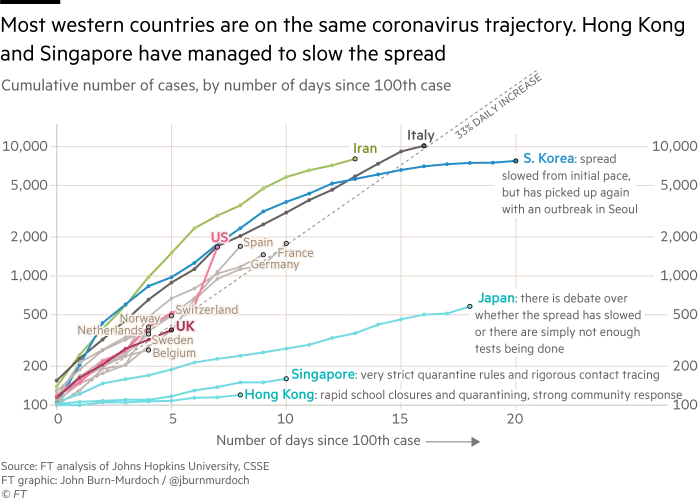

### Learning goals for today:  
#### (1) Learn how to make publication-ready graphs and tables  
#### (2) Understand the need for social distancing to address Covid19

```{r setup, include=FALSE}
# Note: I can set universal settings for chunks (here, it always shows work, but never messages or warnings)
knitr::opts_chunk$set(echo = TRUE, message = F, warning = F)

# we will use two new packages, please install:
# install.packages("ggthemes")
# install.packages("cowplot")

```

## I. Pretty graph exercises: labels and annotation
### _Visualizing Covid19 cases worldwide_

Total worldwide cases have increased this year, with two clear periods, a "China period" and a "Pandemic period". Here is a graph of cases since late January. 
```{r}
library(tidyverse)
library(lubridate)
worlddata <- read_csv("worldwide.csv") %>%
  mutate(date=mdy(date))

# Graph the data
# Note: for fun I colored it skyblue using both the name and the hexcode!
ggplot(worlddata, aes(x = date, y = cases)) + geom_point(color = "skyblue", size = 2) + geom_smooth(se=F, span=.1, color = "#87ceeb") + 
  

# (1) Use labs() to adjust axes labels
# It's a good idea to replace short variable names with more detailed names, and when appropriate give units

labs(x = "Date", y = "Cases of Covid 19") +
  
# TASK: Add a title to the graph. Have the title summarize the main finding of the graph
# rather than just describing what the graph contains


# (2) It can be useful to label individual observations, and groups.
# Sometimes it's better to put group names on the graph versus a legend
# And sometimes you want to highlight key places
 annotate("text", x = as.Date('2020-01-28'), y=37000, label = "China period") + 
  geom_segment(aes(x=as.Date("2020-02-01"), xend=as.Date("2020-02-04"), y=35000, yend=30000), 
               arrow = arrow(length = unit(0.2, "cm")))

## TASK: Annotate the graph at the point it becomes a pandemic
## Hint: it is toward the end, when the rate starts to increase
```

## II. Pretty graph exercise: scales
### _Visualizing Covid19 cases outside of China_


To really get a sense of the exponential growth we are experiencing, let's look just at the cases outside of China.

```{r}

notchina <- read_csv("notchina.csv") %>%
    mutate(date=mdy(date))

# Scales control how data values are mapped visually. 
# ggplot2 makes a best-guess of scales for you. If scales were explicit, it would be like this
# (note that R above was just that good and saw that our x axis was a date format):

ggplot(notchina, aes(x = date, y = cases)) + geom_point(color = "skyblue", size = 2) + geom_smooth(se=F, span=.1, color = "#87ceeb")   +
  scale_x_date() +
  scale_y_continuous() +
  scale_colour_discrete() +
  
  # let's put some labs back on
  labs(x = "Date", y = "Cases", title = "Cases of Covid 19 outside of China") +
  

# Times when you might want to override default scales include:
# 1) You want to tweak a parameter, such as change the breaks on axes 
# (Remove hashtags before the + above and before this line of code)
  scale_x_date(date_breaks = "1 week", date_labels = "%b %d")

# TASK: This looks like exponential growth to me! 
# Check to see by plotting the y on a log scale


```

## III. Pretty graph exercise: Themes
### _What is the point of social distancing?_

One of the most important concepts for controlling Covid19 is that of "flattening the curve". Mitigation through social distancing helps reduce the rate of transmission, which keeps the healthcare system from becoming overwhelmed. This doesn't reduce the total number of cases necessarily, but it does spread them out over time. This is why we are having class remotely today, and why classes will be remote after break. 

```{r}

## Run through to create "mygraph" - then we'll play with its appearance
mean_sim <- 10
std_sim <- 5

lcb <- ((mean_sim - (3 * std_sim)) - 5)
ucb <- (((3 * mean_sim) + (3 * (3 * std_sim))) + 5)

mygraph <- ggplot(data = data.frame(u = c(lcb, ucb)),
       mapping = aes(x = u)) +
  # don't worry about this too much, but note that you can plot a distribution directly instead of fit to data
  stat_function(mapping = aes(colour = "Business as usual"),
                fun = dnorm,
                args = list(mean = mean_sim,
                            sd = std_sim)) +
  stat_function(mapping = aes(colour = "With social distancing"),
                fun = dnorm,
                args = list(mean = (3 * mean_sim),
                            sd = (3 * std_sim))) 

  
  # Here's another scale option - when you color base on categories, you can set what they are
mygraph +  scale_colour_manual(values = c("red", "blue")) +

  # And you can give descriptive titles to your legend as well
  labs(x = "Time since first case",
       y = "Number of cases",
       title = "Flatten the curve!", 
       color = "Scenario") +
  
  # And can add line to the graph where the health care capacity is:
  geom_hline(yintercept = .028, lty = "dashed") + 
  # Finally, we can change the appearance of our graphs with themes
  # For example, the default ggplot background is pretty ugly. We can clean it up with the classic theme
  theme_classic() + 
  
  # And we can modify theme elements manually 
  # Here I got rid of some axis texts (we don't care about the values - this graph is conceptual)
  theme(axis.text.x =  element_blank(), axis.ticks = element_blank()) +
  
  # And I moved the legend inside the plots
  theme(legend.position = c(0.8, 0.8)) 

  # TASK: remove the axis text from the y axis as well
  # TASK: Increase the font size of the text to 16
  # TASK: Annotate to describe what the dashed line is


# You can make your own themes and there's also a whole library of themes:
library(ggthemes)

# Not the *most* useful, but fun
# Any election or news junkies in the house?
mygraph + ggthemes::theme_fivethirtyeight()

mygraph + ggthemes::theme_economist()

# And we are all wayyy better than this now, but we could pretend we used excel ;) 
mygraph + ggthemes::theme_excel()


  
```

## IV. Pretty graph exercise: Combining panels
### _Understanding who is contracting versus dying from Covid19_

We all need to practice social distancing to protect one another. But this is really a time for you to protect the more vulnerable among us. To understand that, let's look at who is contracting versus dying from Covid 19. 
```{r}
skorea <- read_csv("southkorea-distribution.csv")
library(cowplot)

# plot the number of cases in South Korea by age
casesplot <- ggplot(skorea, aes(x=as.factor(Age), y = as.factor(Cases))) + geom_bar(stat = "identity")

# plot the number of deaths in South Korea by age
deathplot <- ggplot(skorea, aes(x=as.factor(Age), y = as.factor(Deaths))) + geom_bar(stat = "identity")

# put them together in one column to compare the distributions
# note: the align argument allows you to align the axes (what happens if you don't include it?)
plot_grid(casesplot, deathplot, ncol = 1, align = "v")

# TASK: Since the x axes are the same, it's cleaner to remove the axis label and text from the top one
# Remove those using your knowledge from (4), and clean up the labels using your knowledge from (1)

```

## V. Markdown basics: Embedding figures

Hubei provence shows how effective social distancing can be. Shortly after lockdown the number of true cases immediately started to drop. Note that the number of confirmed cases increased for a time after the number of true cases started to decline, because more people became symptomatic and testing increased. 


```{r, Hubei provence, out.width='150%', fig.cap="Source: Tomas Pueyo analysis over chart from the Journal of the American Medical Association, based on raw case data from the Chinese Center for Disease Control and Prevention"}
library(knitr) 
 
# read in the saved graphic
knitr::include_graphics("eventsinhubei.png")
```


When social distancing is implemented makes an enormous difference. Countries affected by SARS were quicker to act, whereas most western countries have been slower. The US is on trajectory to be where Italy is in around a week. 
```{r, Trajectories by country, out.width='150%'}
library(knitr) 
 
# read in the saved graphic

```


## VI. Markdown basics: Tables 
### _The importance of testing_

The US is dramatically undertesting compared to other countries. For context, here is a table of tests performed (total and relative to the population), and the positive test rates. The low rates of testing and the high positive test rate suggests that there are many more people in the US that have Covid19 than are confirmed. Compiled by Tomas Pueyo, data from Worldometer https://www.worldometers.info.coronavirus/covid-10-testing/


Country | Tests performed | Tests per million citizens | Positive test rate 
------|-------|------------|-----------------------------------------
South Korea | 109591 | 2138 | 4.4%
Italy | 23345| 386 | 8.7%
Austria | 2120| 235 | 0.8%
Switzerland | 1850 | 214 | 1.6%
UK | 13525 | 199 | 0.3%
Finland | 130 | 23 | 5.4%
Turkey | 940 | 11 | 0.0%
United States | 472 | 1 | 21.8%


Note: much of the data presented here was compiled by Tomas Pueyo:
https://medium.com/@tomaspueyo/coronavirus-act-today-or-people-will-die-f4d3d9cd99ca